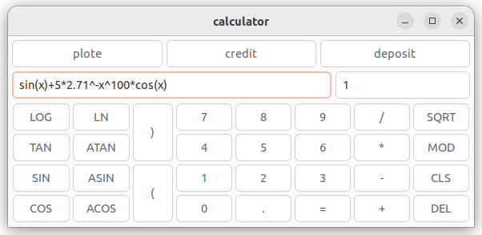
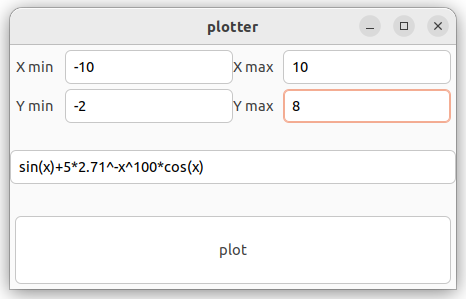
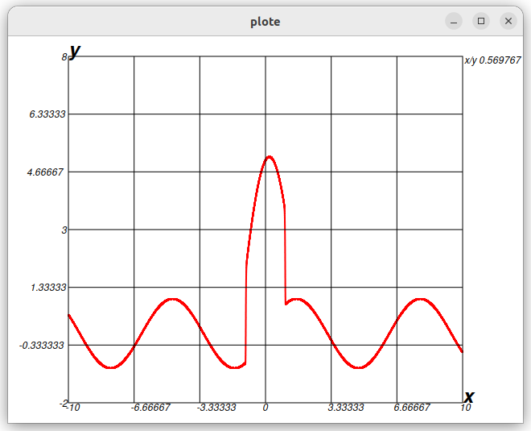

# Калькулятор на языке C

Учебный проект по написанию калькулятора с использованием библиотеки GTK+.

Проект включает в себя:
* калькулятор с графическим интерфейсом;
* парсер математических выражений с поддержкой базовых операций;
* поддержку базовых математических функций;
* корректную обработку последовательности математических орпеаций;
* возможность построения графика функции от одной x;
* возможность изменения области значения и оперделения функции.

Плюсом проекта является его модульность.
Минусом - отсутствие конфигурационнгого файла, все параметры разбросаны по коду.

Требования для сборки:
* gtk+3.0
* gcc с поддержкой c11
* asan lib т.к проект по умолчанию собирается в режиме дебага. По необходимости это можно отключить.
